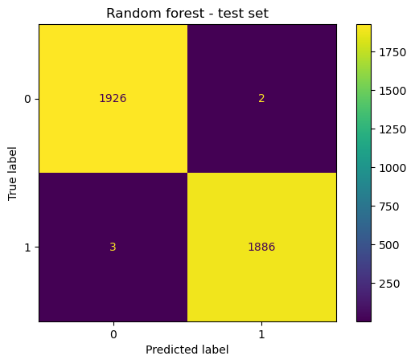

# TikTok Claims Classifier

Classifies TikTok videos as **claims** or **opinions**, so a moderation team can prioritise which
reported videos need human review first. This is the end-of-program capstone of the
**Google Advanced Data Analytics Professional Certificate**, built on its synthetic TikTok dataset
(19,382 videos; 19,084 after dropping rows with missing values).

## Result

**Champion: random forest. On the held-out test set it misclassified 5 of 3,817 videos** (99.87% accuracy, 99.8% recall on claims).

| Model | Split | Recall (claims) | Precision | F1 |
|---|---|---:|---:|---:|
| Random forest | 5-fold CV | 0.995 | — | — |
| XGBoost | 5-fold CV | 0.991 | — | — |
| Random forest | Validation (3,817) | 1.00 | 1.00 | 1.00 |
| XGBoost | Validation (3,817) | 0.99 | 1.00 | 0.99 |
| **Random forest** | **Test (3,817)** | **0.998** | **0.999** | **0.999** |

<p align="center"></p>
<p align="center"><sub>Test set. 0 = opinion, 1 = claim.</sub></p>

**What drives it:** engagement. Views, likes, shares and downloads were the most predictive features,
which matches what EDA showed: claim videos have a median of about 502k views, against about 5k for
opinions.

Recall on claims was the selection metric. Missing a claim (a false negative) is the costly error
here, because it skips human review.

## The workflow

Each stage has a notebook and an executive summary, following Google's PACE framework
(Plan, Analyze, Construct, Execute):

| # | Stage | Notebook | Summary |
|---|---|---|---|
| 1 | Data inspection | [Preliminary analysis](Tik_Tok/Preliminary_Analysis_of_the_Data.ipynb) | [PACE strategy](Tik_Tok/PACE%20strategy%20document.pdf) |
| 2 | Exploratory data analysis | [EDA](Tik_Tok/Exploratory%20Data%20Analysis/EDA%20TikTok%20project%20lab.ipynb) | [PDF](Tik_Tok/Exploratory%20Data%20Analysis/EDA%20executive%20summary.pdf) |
| 3 | Hypothesis testing | [Notebook](Tik_Tok/Data%20exploration%20and%20Hypothesis%20testing/Data%20exploration%20and%20Hypothesis%20testing%20TikTok%20project%20lab.ipynb) | [PPTX](Tik_Tok/Data%20exploration%20and%20Hypothesis%20testing/Data%20Exploration%20and%20Hypothesis%20testing%20executive_summary.pptx) |
| 4 | Logistic regression | [Notebook](Tik_Tok/Regression%20Modeling/Regrssion%20Modelling%20project%20lab.ipynb) | [PPTX](Tik_Tok/Regression%20Modeling/Regression_Modelling_Executive_Summary.pptx) |
| 5 | **Classification models** | [Notebook](Tik_Tok/Classifying%20Videos/Classifying%20videos%20using%20machine%20learning.ipynb) | [PPTX](Tik_Tok/Classifying%20Videos/Classifying%20Videos%20Executive%20Summary.pptx) |

**Modelling setup:**
- Split: 60 / 20 / 20 into train, validation and test.
- Features: engagement counts, video duration, author and verification status, transcription length, and the 15 most common 2–3-word phrases from the transcription (`CountVectorizer`).
- Tuning: `GridSearchCV` with `refit='recall'`.

## Run it

```bash
pip install pandas numpy scikit-learn xgboost matplotlib seaborn scipy jupyter
jupyter notebook
```

The dataset comes from the certificate program and isn't redistributed here.

## Stack

Python · pandas · scikit-learn · XGBoost · SciPy · matplotlib / seaborn
